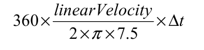
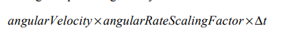
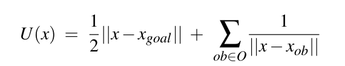
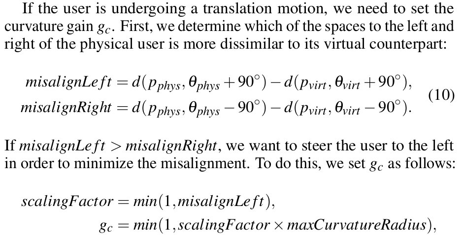
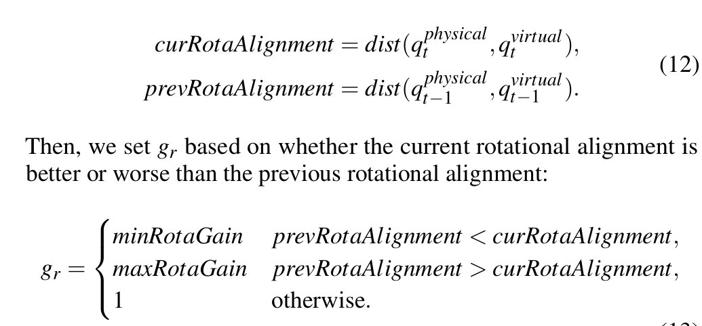

# rdw notes

## general algorithm

一般的情况下，我们是知道三种增益，然后实践在平移和旋转的增量上
平移增益：还是直接用 min 值定下来吧
曲率增益算出来的旋转增量为

反推得半径为 7.5 m
旋转增益算出来的旋转增量为

那看起来可能 angularRateScalingFactor 也是预定的
dampen: 当人离障碍物 1.25 m 时，ROT_GAIN * = dist/1.25

the only difference lies in where the user is being steered

## S2C (steer to center)

steer-to-center 应该是最强的一个策略
我们预设一个点在空间的中心，我的理解是让用户由直线行走变为绕着中心转“8”字形，此时用户也不用旋转就可以直接走直线了
我们可能要简单梳理一下 steer 是什么意思
首先 半径和行走的比例不能改变，只能变的是旋转的比例和 reset 的比例
这样的话 每次我们旋转就就改变旋转的角度比例，让他尽可能的朝向中心，可能要启发式一点了
我们拿到的数据是用户的位置 朝向，速度，角速度
首先我们加一个判断 如果方位角和中心夹角大于160°就生成临时引导目标，这个目标是在4米远的地方，位于当前航向的90°方向
对于当前 target，我们这样做：首先降低 translation gain 然后设定 curvature gain radius 和旋转方向使其朝向中心转
然后判断是否有角速度，如果有且是朝向中心转 就增大 rotation gain 为最大，否则就减小 rotation gain 为最小
然后此外角速度还需要多加上一步，计算 曲率增益和旋转增益并且取 max
用户的方位角与中心的夹角大于160º时生成一个临时引导目标，解决了这一问题。临时目标设置在离用户4米远的地方，位于当前航向的90º方向，且朝向能够尽快将用户引回跟踪区域中心的方向。当用户的方位角再次小于160º时，临时目标被抛弃，引导指令重新指引用户朝向中心。

## S2O (steer to orbit)

steer-to-center 应该是最强的一个策略
我们预设一个点在空间的中心，我的理解是让用户由直线行走变为绕着中心转“8”字形，此时用户也不用旋转就可以直接走直线了
我们可能要简单梳理一下 steer 是什么意思
首先 半径和行走的比例不能改变，只能变的是旋转的比例和 reset 的比例
这样的话 每次我们旋转就就改变旋转的角度比例，让他尽可能的朝向中心，可能要启发式一点了
我们拿到的数据是用户的位置 朝向，速度，角速度
首先我们加一个判断 如果方位角和中心夹角大于160°就生成临时引导目标，这个目标是在4米远的地方，位于当前航向的90°方向
对于当前 target，我们这样做：首先降低 translation gain 然后设定 curvature gain radius 和旋转方向使其朝向中心转
然后判断是否有角速度，如果有且是朝向中心转 就增大 rotation gain 为最大，否则就减小 rotation gain 为最小
然后此外角速度还需要多加上一步，计算 曲率增益和旋转增益并且取 max
用户的方位角与中心的夹角大于160º时生成一个临时引导目标，解决了这一问题。临时目标设置在离用户4米远的地方，位于当前航向的90º方向，且朝向能够尽快将用户引回跟踪区域中心的方向。当用户的方位角再次小于160º时，临时目标被抛弃，引导指令重新指引用户朝向中心。

## APF

it works by pushing the user away from undesirable locations (boundaries and obstacles) and pulling the user towards desirable locations (goals)closer to S2C with center based translation gain
Potential function 如下:

其中到障碍物的距离是算成到障碍物的最近距离

> the possibility to have a goal position that does not necessarily have the purpose of keeping the user away from the boundaries

省流：用公式算出施力向量（或者类似物）根据该向量和当前速度的夹角来调整三个增益值

reset
SFR2G 是最强的方案 我们就实现它吧 大概想法 belike 每次沿着梯度下降的方向采取若干小步 然后返回

## ARC

In this paper, we are concerned with steering users on collision-free paths in the PE and VE at the same time.
With traditional RDW controllers, the goal of the system is to steer the user away from obstacles in the PE.With analignment-based controller, the goal is to steer the user to a physical state that most  closely matches the virtual state.
def A(Qt) = dist(qt_phys,qt_virt) if A(Qt) == 0 then apply no redirection
translation gain gt = clamp(d(phys,theta_phys)/d(virt,theta_virt), minTransgain, maxTransgain)
curvature gain 如下:

其中方向由左右的偏差决定
具体的 curvature gain radius 怎么算，其中半径上下界分别是 +inf 和 7.5 m，然后我们想取到的值是 (1/misalign_left)*7.5 m if misalign_left < 1 else 7.5 m
rotation gain 如下：

